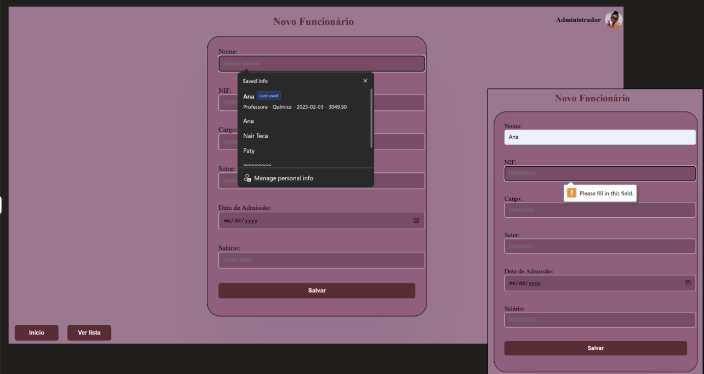
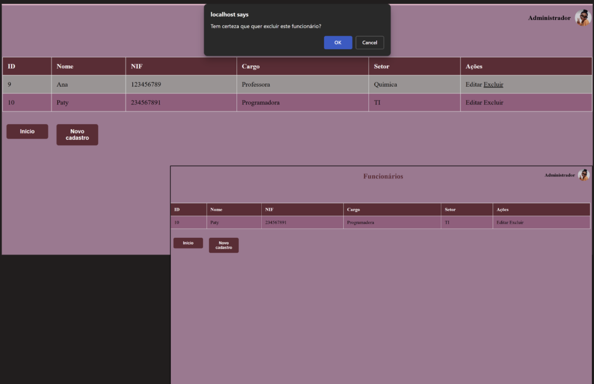

# Sistema de Gestão de Funcionários em PHP

## Descrição
Este projeto é um sistema simples de gestão de pessoas desenvolvido em PHP. Permite operações básicas de cadastro, visualização, edição e remoção de pessoas (**CRUD**), com interface web e utilização de um banco de dados para armazenamento.

## Tecnologias utilizadas
- MySQL
- PHP
- HTML / CSS

## Funcionalidades

- Cadastro de funcionários (nome, dados pessoais, etc.).
- Listagem de funcionários cadastrados.
  

- Edição / atualização de dados de funcionários.
- Remoção de funcionários.
  

