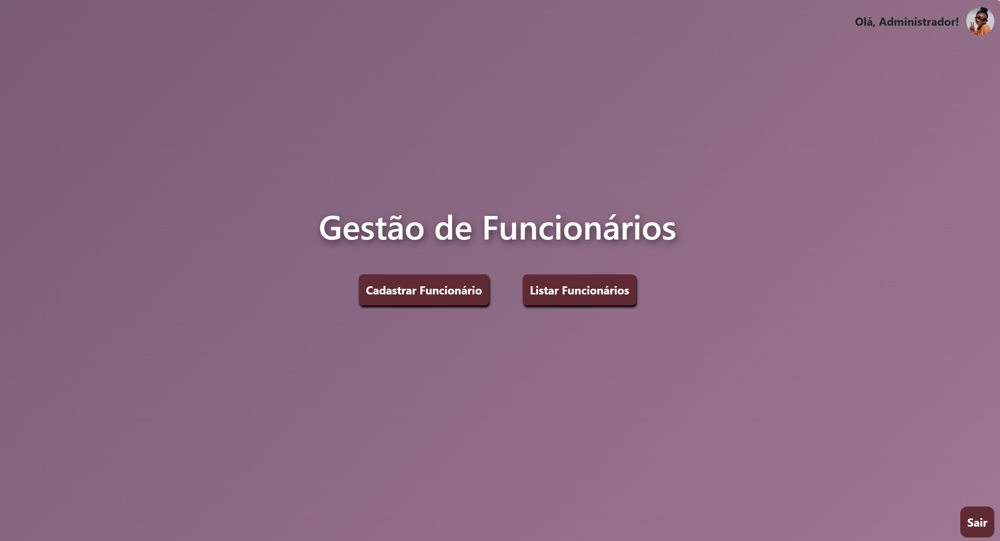
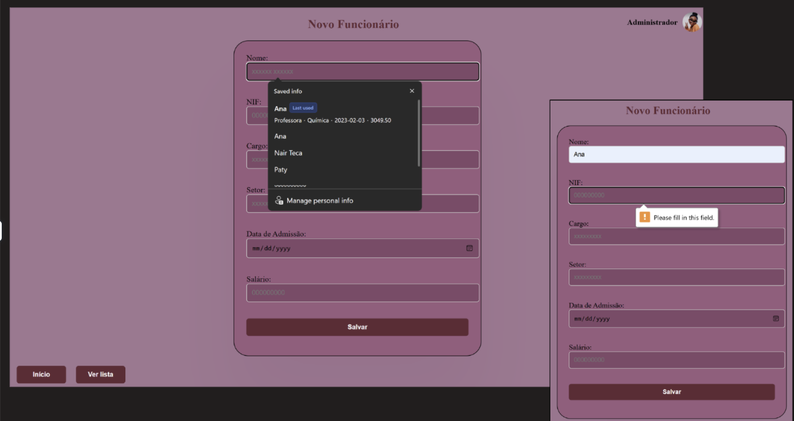
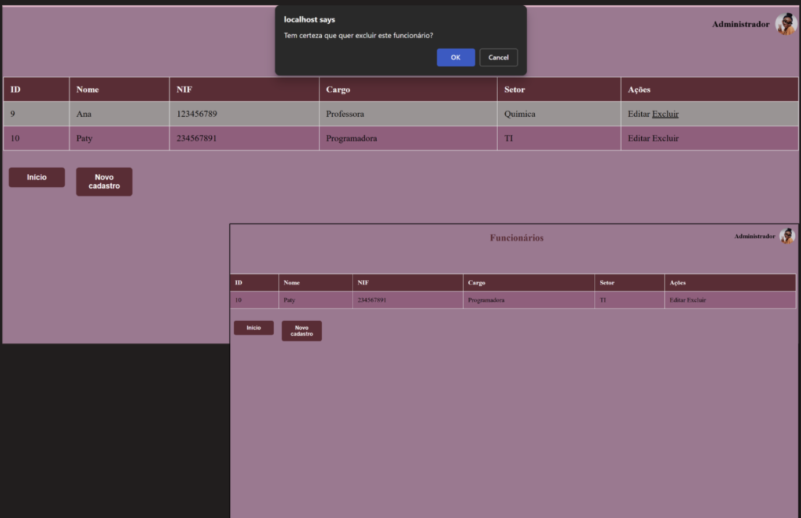

# Sistema de Gestão de Funcionários em PHP (CRUD)

O sistema responde à necessidade de **gestão básica de funcionários**, permitindo operações de criação, consulta, edição e remoção de registos (**CRUD**) através de uma interface web simples.

---

## 📋 Requisitos do Sistema
- Permitir o cadastro de funcionários com dados pessoais
- Garantir validação de campos obrigatórios
- Permitir a edição de dados existentes
- Permitir a remoção de registos com confirmação prévia
- Assegurar a persistência dos dados numa base de dados
- Disponibilizar uma interface simples e intuitiva

---

## 🛠 Tecnologias Utilizadas
- **PHP** – lógica do sistema
- **MySQL** – persistência de dados
- **HTML / CSS** – interface web

---

## 🚀 Funcionalidades

### ➤ Tela Inicial

---

### ➤ Cadastro de Funcionários
- Registo de nome, dados pessoais e outras informações relevantes
- Verificação automática de campos obrigatórios
- Mensagens de erro em caso de preenchimento incompleto

---

### ➤ Listagem de Funcionários
- Visualização de todos os funcionários registados
- Acesso às opções de edição e remoção
- Confirmação antes da eliminação de um registo, evitando exclusões acidentais

---

## 🧱 Estrutura e Arquitetura
O projeto foi desenvolvido com uma **estrutura simples**, adequada ao contexto académico:
- Backend em PHP responsável pela lógica da aplicação
- Base de dados MySQL para armazenamento persistente
- Interface desenvolvida em HTML e CSS
- Separação lógica entre apresentação e acesso aos dados, de forma introdutória

---

## ⚙️ Decisões de Engenharia
- Optei por um sistema CRUD simples por ser adequado aos objetivos do projeto
- Priorizei clareza e legibilidade do código em detrimento de soluções mais complexas
- As validações foram implementadas para garantir integridade dos dados
- A confirmação de eliminação foi adicionada para melhorar a experiência do utilizador e evitar erros

---

## 📚 O que Aprendi
- Levantamento e análise de requisitos funcionais
- Estruturação de um sistema web simples
- Importância da validação de dados e da experiência do utilizador
- Comunicação da solução através de documentação técnica

---

## 🔮 Melhorias Futuras
- Implementação de autenticação e perfis de utilizador
- Separação mais clara em camadas (ex.: padrão MVC)
- Validações adicionais no backend
- Introdução de testes automatizados

---

## 📎 Notas Finais
Este projeto teve como principal foco a **organização, clareza e comunicação da solução**, mais do que a complexidade técnica, servindo como base para o desenvolvimento de competências em **Engenharia de Software**.
